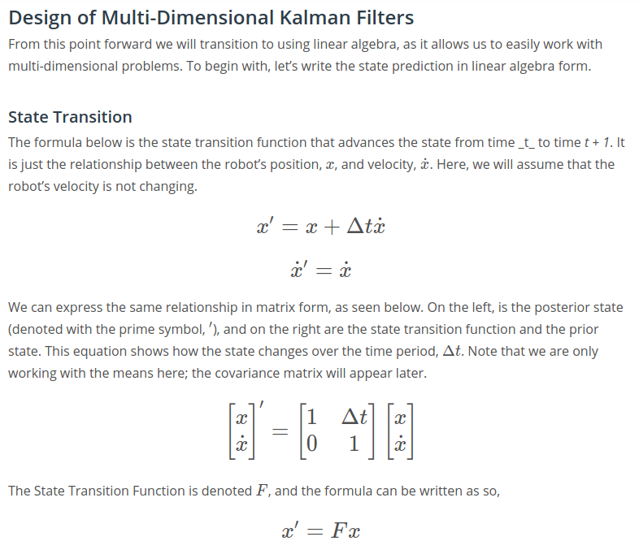
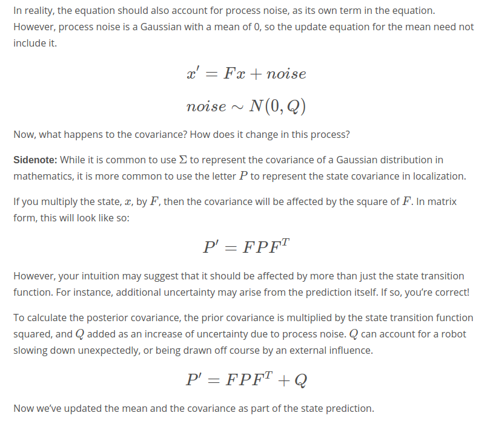
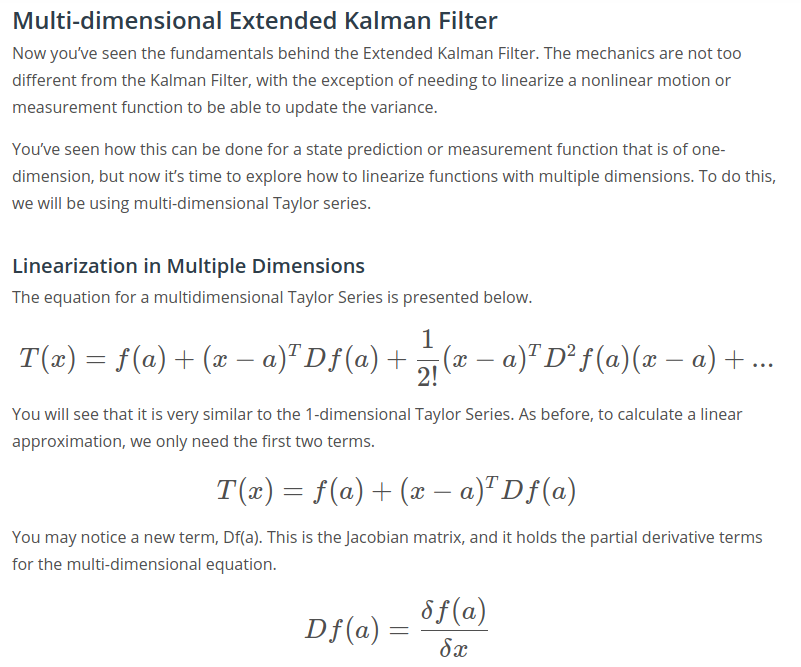
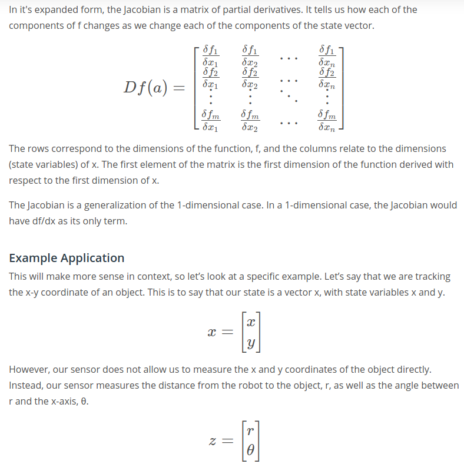
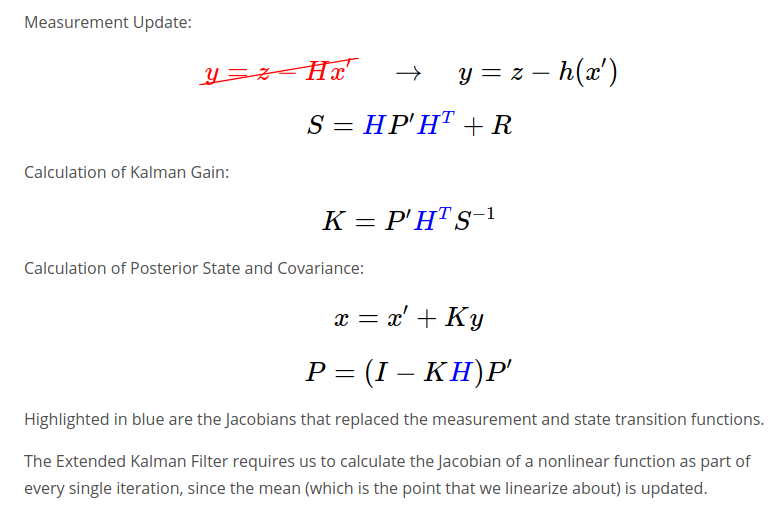
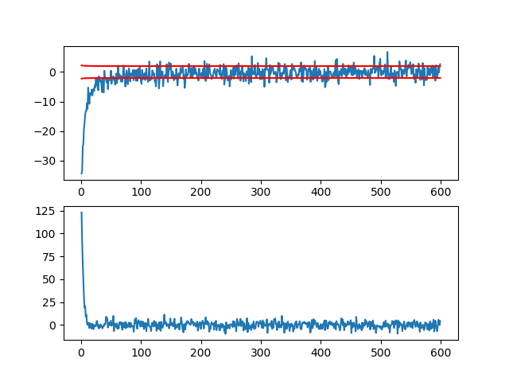

# Kalman filter

# Extended Kalman Filter

### Summary

# Practical work on EKF:

Here in green we can see the keypoint chosen, the robot trajectory is random, and each successive point is represented with a size corresponding to the covariance at this position.

On the first graph, we can see the position innovation in blue with the variance a thos step in red. By changing the gain of the EKF algo, we can get narrower or wider curve.
On the second graph, we have the angular innovation.

